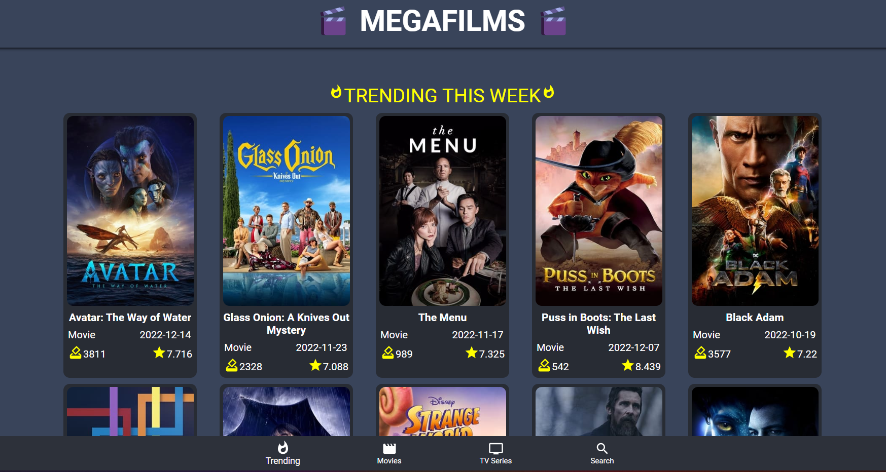
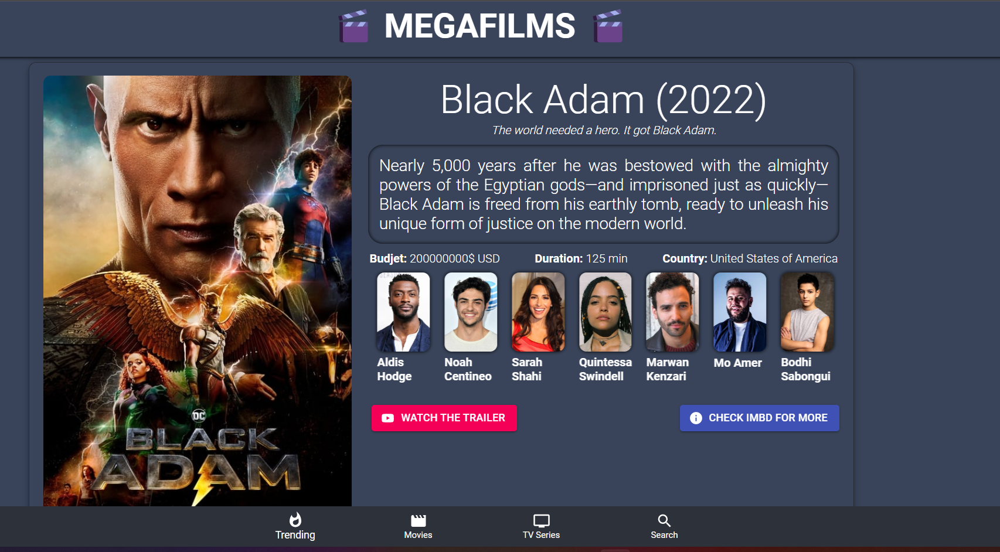

# MegaFilms



### Language: Javascript

### Frameworks : React, Reacr DOM, Material UI

### Deployment: Json Server, netlify

### API: IMDB api


# About
Web app gives information about movies, their rating, casting, type. You can search and filter as you like, check Actors and Actresses and which movies or Tv series they played, their rating, bio and etc.
Looking for quick information or want to find your movie, just visit: 

## Live on: https://megafilms.netlify.app/

If Information is not showing, use VPN!



# Project Setup

## Process

I used Imdb api from: https://api.themoviedb.org/

filtered and connected relational data such as actors to films, films to their info.

I used Material UI for structuring and design.

#### Django project run

```bash
>>> npm start app
```

# Architecture

```
.
└── src
    └── components
        ├──  Actors
        ├──  Carousel
        ├──  Genres
        ├──  Header
        ├──  Pagination
        |___
            ├──  pagination.js
            ├──  pagination.css
       
    └──  Pages
        ├──  Movies
        ├──  Search
        ├──  Series
        ├──  Trending
                |__Trending.js
                |__Trending.css
        
    ├── .gitignore
    ├──  App.Js
    ├──  package.json
```

### models.py

```javascript

<BrowserRouter>
      <Header />
      <div className="app">
        <Container>
          <Switch>
            <Route path="/" component={Trending} exact />
            <Route path="/movies" component={Movies} />
            <Route path="/series" component={Series} />
            <Route path="/search" component={Search} />
            <Route path="/name/:id" component={Actor}/>
            <Route path="/:media_type/:id" component={ContentModal}/>
          </Switch>
        </Container>
      </div>
      <SimpleBottomNavigation />
    </BrowserRouter>

```

